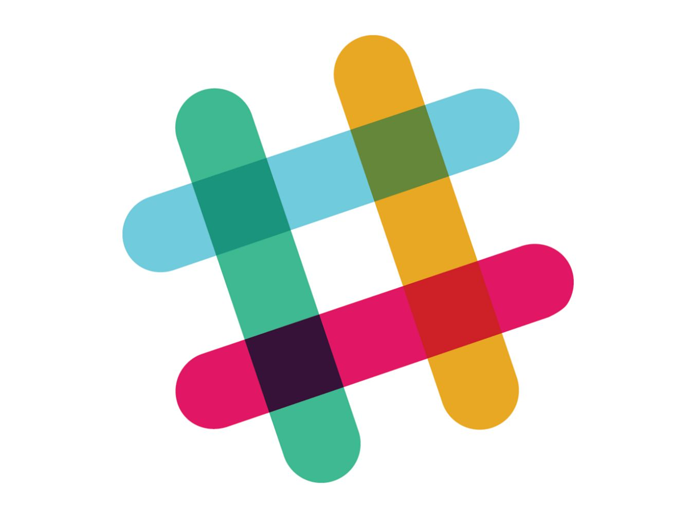

Whiteboard Winners aims to be a community where all software developers can gain or sharpen their technical interviewing skills. We are a group of software developers collaborating to educate developers of all skill levels on best practices and strategies for solving technical whiteboarding questions, as well as practice answering technical questions curated by the members of the team. In a world where interview questions are extremely contrived and often very complex, we will work to empower everyone to succeed and demonstrate their skills as well as possible.

## Join The Slack Group

### Code of Conduct
Because we're an open community aiming to help everyone become a successful programming professional, we pride ourselve in carrying a positive and inclusive environment. Please see the [code of conduct](citizen_code_of_conduct.md) to understand our expectations for those members who participate in this group.
